# 🏗️ E-Commerce Backend — Design Document

> [!NOTE]
> Dokumen perancangan lengkap berdasarkan [VISION.txt](file:///c:/Users/Alfarizy/Documents/Programming%20Volume%203/Projects/ecommerce-backend/VISION.txt).
> Mencakup **Database Design**, **Class Design**, dan **Architecture Design**.

---

# 📊 Part 1: Database Design

## 1.1 Entity Relationship Diagram (ERD)

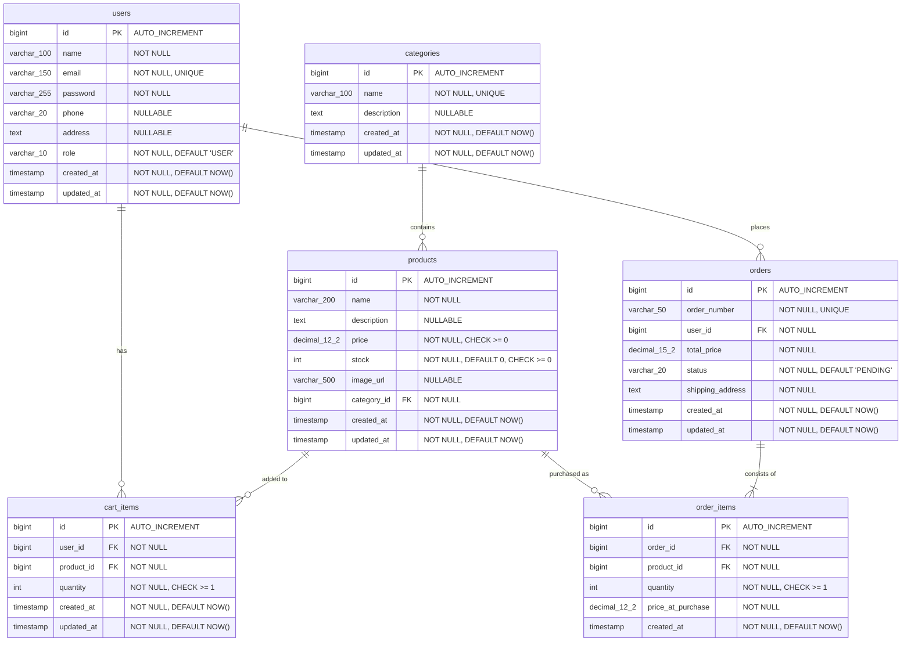

## 1.2 Tabel & Kolom Detail

### `users` — Data akun pengguna

| Kolom | Tipe | Constraint | Keterangan |
|-------|------|------------|------------|
| `id` | `BIGINT` | PK, AUTO_INCREMENT | Primary key |
| `name` | `VARCHAR(100)` | NOT NULL | Nama lengkap |
| `email` | `VARCHAR(150)` | NOT NULL, UNIQUE | Email untuk login |
| `password` | `VARCHAR(255)` | NOT NULL | BCrypt hashed password |
| `phone` | `VARCHAR(20)` | NULLABLE | Nomor telepon |
| `address` | `TEXT` | NULLABLE | Alamat default |
| `role` | `VARCHAR(10)` | NOT NULL, DEFAULT `'USER'` | `USER` atau `ADMIN` |
| `created_at` | `TIMESTAMP` | NOT NULL | Waktu registrasi |
| `updated_at` | `TIMESTAMP` | NOT NULL | Waktu update terakhir |

---

### `categories` — Kategori produk

| Kolom | Tipe | Constraint | Keterangan |
|-------|------|------------|------------|
| `id` | `BIGINT` | PK, AUTO_INCREMENT | Primary key |
| `name` | `VARCHAR(100)` | NOT NULL, UNIQUE | Nama kategori |
| `description` | `TEXT` | NULLABLE | Deskripsi kategori |
| `created_at` | `TIMESTAMP` | NOT NULL | Waktu dibuat |
| `updated_at` | `TIMESTAMP` | NOT NULL | Waktu update |

---

### `products` — Data produk

| Kolom | Tipe | Constraint | Keterangan |
|-------|------|------------|------------|
| `id` | `BIGINT` | PK, AUTO_INCREMENT | Primary key |
| `name` | `VARCHAR(200)` | NOT NULL | Nama produk |
| `description` | `TEXT` | NULLABLE | Deskripsi produk |
| `price` | `DECIMAL(12,2)` | NOT NULL, CHECK ≥ 0 | Harga produk |
| `stock` | `INT` | NOT NULL, DEFAULT 0, CHECK ≥ 0 | Stok tersedia |
| `image_url` | `VARCHAR(500)` | NULLABLE | URL gambar produk |
| `category_id` | `BIGINT` | FK → `categories.id`, NOT NULL | Relasi ke kategori |
| `created_at` | `TIMESTAMP` | NOT NULL | Waktu dibuat |
| `updated_at` | `TIMESTAMP` | NOT NULL | Waktu update |

---

### `cart_items` — Keranjang belanja user

| Kolom | Tipe | Constraint | Keterangan |
|-------|------|------------|------------|
| `id` | `BIGINT` | PK, AUTO_INCREMENT | Primary key |
| `user_id` | `BIGINT` | FK → `users.id`, NOT NULL | Pemilik keranjang |
| `product_id` | `BIGINT` | FK → `products.id`, NOT NULL | Produk di keranjang |
| `quantity` | `INT` | NOT NULL, CHECK ≥ 1 | Jumlah item |
| `created_at` | `TIMESTAMP` | NOT NULL | Waktu ditambahkan |
| `updated_at` | `TIMESTAMP` | NOT NULL | Waktu update |

> [!IMPORTANT]
> Kombinasi `(user_id, product_id)` sebaiknya dibuat **UNIQUE** agar satu user tidak punya duplikat produk di keranjang. Jika user menambah produk yang sama, maka `quantity` yang di-update.

---

### `orders` — Data order/pesanan

| Kolom | Tipe | Constraint | Keterangan |
|-------|------|------------|------------|
| `id` | `BIGINT` | PK, AUTO_INCREMENT | Primary key |
| `order_number` | `VARCHAR(50)` | NOT NULL, UNIQUE | Nomor order (e.g. `ORD-20260716-0001`) |
| `user_id` | `BIGINT` | FK → `users.id`, NOT NULL | User yang memesan |
| `total_price` | `DECIMAL(15,2)` | NOT NULL | Total harga seluruh item |
| `status` | `VARCHAR(20)` | NOT NULL, DEFAULT `'PENDING'` | Status order |
| `shipping_address` | `TEXT` | NOT NULL | Alamat pengiriman |
| `created_at` | `TIMESTAMP` | NOT NULL | Waktu order dibuat |
| `updated_at` | `TIMESTAMP` | NOT NULL | Waktu update status |

---

### `order_items` — Item-item dalam satu order

| Kolom | Tipe | Constraint | Keterangan |
|-------|------|------------|------------|
| `id` | `BIGINT` | PK, AUTO_INCREMENT | Primary key |
| `order_id` | `BIGINT` | FK → `orders.id`, NOT NULL | Relasi ke order |
| `product_id` | `BIGINT` | FK → `products.id`, NOT NULL | Produk yang dipesan |
| `quantity` | `INT` | NOT NULL, CHECK ≥ 1 | Jumlah item |
| `price_at_purchase` | `DECIMAL(12,2)` | NOT NULL | Harga saat pembelian |
| `created_at` | `TIMESTAMP` | NOT NULL | Waktu dibuat |

> [!IMPORTANT]
> `price_at_purchase` menyimpan **snapshot harga** saat pembelian. Ini penting agar perubahan harga produk di masa depan tidak mengubah histori order yang sudah ada.

## 1.3 Enum Values

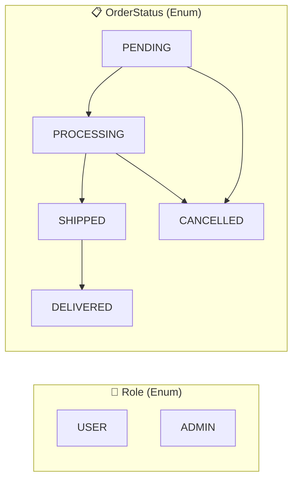

| Enum | Values | Keterangan |
|------|--------|------------|
| `Role` | `USER`, `ADMIN` | Hak akses pengguna |
| `OrderStatus` | `PENDING` → `PROCESSING` → `SHIPPED` → `DELIVERED` / `CANCELLED` | Alur status order |

## 1.4 Index Strategy

| Tabel | Index | Tipe | Alasan |
|-------|-------|------|--------|
| `users` | `email` | UNIQUE | Login lookup, mencegah duplikat |
| `categories` | `name` | UNIQUE | Mencegah duplikat nama kategori |
| `products` | `category_id` | INDEX | Filter produk berdasarkan kategori |
| `products` | `name` | INDEX | Full-text search produk |
| `products` | `price` | INDEX | Filter & sorting berdasarkan harga |
| `cart_items` | `(user_id, product_id)` | UNIQUE | Satu user, satu produk per entry |
| `cart_items` | `user_id` | INDEX | Fetch semua cart milik satu user |
| `orders` | `user_id` | INDEX | Fetch semua order milik satu user |
| `orders` | `order_number` | UNIQUE | Lookup by order number |
| `order_items` | `order_id` | INDEX | Fetch semua item dalam satu order |

## 1.5 Relasi Antar Tabel

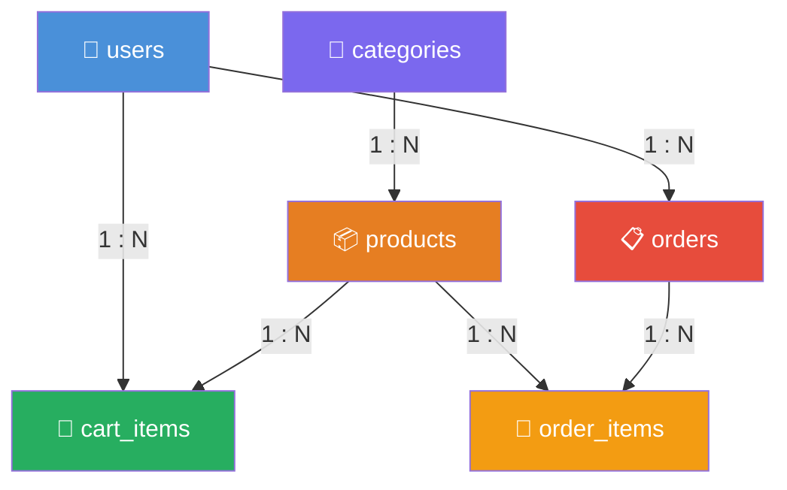

| Dari | Ke | Tipe | Foreign Key |
|------|----|------|-------------|
| `users` | `cart_items` | One-to-Many | `cart_items.user_id` → `users.id` |
| `users` | `orders` | One-to-Many | `orders.user_id` → `users.id` |
| `categories` | `products` | One-to-Many | `products.category_id` → `categories.id` |
| `products` | `cart_items` | One-to-Many | `cart_items.product_id` → `products.id` |
| `products` | `order_items` | One-to-Many | `order_items.product_id` → `products.id` |
| `orders` | `order_items` | One-to-Many | `order_items.order_id` → `orders.id` |

---
---

# 🧩 Part 2: Class Design

## 2.1 Domain Entity Classes

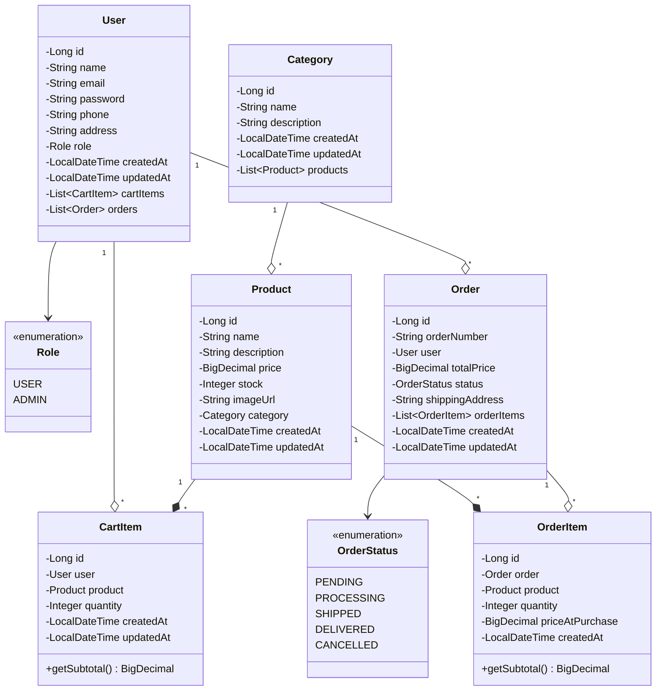

## 2.2 DTO Classes (Request & Response)

### Request DTOs

```mermaid
classDiagram
    class RegisterRequest {
        -String name
        -String email
        -String password
    }

    class LoginRequest {
        -String email
        -String password
    }

    class UpdateProfileRequest {
        -String name
        -String phone
        -String address
    }

    class ChangePasswordRequest {
        -String currentPassword
        -String newPassword
    }

    class ProductRequest {
        -String name
        -String description
        -BigDecimal price
        -Integer stock
        -String imageUrl
        -Long categoryId
    }

    class CategoryRequest {
        -String name
        -String description
    }

    class CartItemRequest {
        -Long productId
        -Integer quantity
    }

    class UpdateCartItemRequest {
        -Integer quantity
    }

    class UpdateOrderStatusRequest {
        -String status
    }

    class CheckoutRequest {
        -String shippingAddress
    }
```

### Response DTOs

```mermaid
classDiagram
    class ApiResponse~T~ {
        -boolean success
        -String message
        -T data
        -LocalDateTime timestamp
        +of(message, data)$ ApiResponse
        +error(message)$ ApiResponse
    }

    class AuthResponse {
        -String token
        -String tokenType
        -UserResponse user
    }

    class UserResponse {
        -Long id
        -String name
        -String email
        -String phone
        -String address
        -String role
        -LocalDateTime createdAt
    }

    class ProductResponse {
        -Long id
        -String name
        -String description
        -BigDecimal price
        -Integer stock
        -String imageUrl
        -String categoryName
        -Long categoryId
        -LocalDateTime createdAt
    }

    class CategoryResponse {
        -Long id
        -String name
        -String description
        -int productCount
        -LocalDateTime createdAt
    }

    class CartItemResponse {
        -Long id
        -Long productId
        -String productName
        -BigDecimal productPrice
        -String productImageUrl
        -Integer quantity
        -BigDecimal subtotal
    }

    class CartResponse {
        -List~CartItemResponse~ items
        -int totalItems
        -BigDecimal totalPrice
    }

    class OrderResponse {
        -Long id
        -String orderNumber
        -BigDecimal totalPrice
        -String status
        -String shippingAddress
        -List~OrderItemResponse~ items
        -LocalDateTime createdAt
    }

    class OrderItemResponse {
        -Long id
        -String productName
        -Integer quantity
        -BigDecimal priceAtPurchase
        -BigDecimal subtotal
    }
```

> [!TIP]
> **Kenapa pakai DTO?**
> - Mencegah eksposur field sensitif (e.g. `password` pada `User`)
> - Memberi kontrol penuh terhadap bentuk JSON request & response
> - Memisahkan representasi database dari representasi API

### DTO Mapping Flow

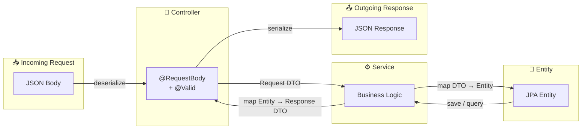

## 2.3 Service Classes

```mermaid
classDiagram
    class AuthService {
        -UserRepository userRepository
        -PasswordEncoder passwordEncoder
        -JwtTokenProvider jwtTokenProvider
        +register(RegisterRequest) UserResponse
        +login(LoginRequest) AuthResponse
    }

    class UserService {
        -UserRepository userRepository
        -PasswordEncoder passwordEncoder
        +getProfile(Long userId) UserResponse
        +updateProfile(Long userId, UpdateProfileRequest) UserResponse
        +changePassword(Long userId, ChangePasswordRequest) void
    }

    class ProductService {
        -ProductRepository productRepository
        -CategoryRepository categoryRepository
        +createProduct(ProductRequest) ProductResponse
        +getProductById(Long id) ProductResponse
        +getAllProducts(String search, Long categoryId, BigDecimal minPrice, BigDecimal maxPrice, Pageable) Page~ProductResponse~
        +updateProduct(Long id, ProductRequest) ProductResponse
        +deleteProduct(Long id) void
    }

    class CategoryService {
        -CategoryRepository categoryRepository
        +createCategory(CategoryRequest) CategoryResponse
        +getAllCategories() List~CategoryResponse~
        +getCategoryById(Long id) CategoryResponse
        +updateCategory(Long id, CategoryRequest) CategoryResponse
        +deleteCategory(Long id) void
    }

    class CartService {
        -CartItemRepository cartItemRepository
        -ProductRepository productRepository
        +addToCart(Long userId, CartItemRequest) CartItemResponse
        +getCart(Long userId) CartResponse
        +updateCartItem(Long userId, Long itemId, UpdateCartItemRequest) CartItemResponse
        +removeFromCart(Long userId, Long itemId) void
    }

    class OrderService {
        -OrderRepository orderRepository
        -OrderItemRepository orderItemRepository
        -CartItemRepository cartItemRepository
        -ProductRepository productRepository
        +checkout(Long userId, CheckoutRequest) OrderResponse
        +getMyOrders(Long userId, Pageable) Page~OrderResponse~
        +getMyOrderById(Long userId, Long orderId) OrderResponse
        +getAllOrders(Pageable) Page~OrderResponse~
        +updateOrderStatus(Long orderId, UpdateOrderStatusRequest) OrderResponse
    }
```

## 2.4 Repository Interfaces

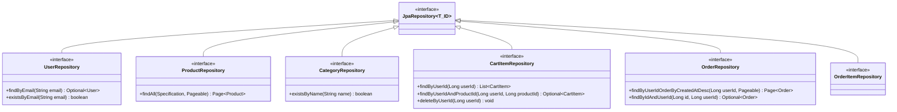

## 2.5 Controller Classes

```mermaid
classDiagram
    class AuthController {
        -AuthService authService
        +register(RegisterRequest) ResponseEntity
        +login(LoginRequest) ResponseEntity
    }

    class UserController {
        -UserService userService
        +getProfile() ResponseEntity
        +updateProfile(UpdateProfileRequest) ResponseEntity
        +changePassword(ChangePasswordRequest) ResponseEntity
    }

    class ProductController {
        -ProductService productService
        +getAllProducts(search, categoryId, minPrice, maxPrice, pageable) ResponseEntity
        +getProductById(Long id) ResponseEntity
    }

    class AdminProductController {
        -ProductService productService
        +createProduct(ProductRequest) ResponseEntity
        +updateProduct(Long id, ProductRequest) ResponseEntity
        +deleteProduct(Long id) ResponseEntity
    }

    class CategoryController {
        -CategoryService categoryService
        +getAllCategories() ResponseEntity
    }

    class AdminCategoryController {
        -CategoryService categoryService
        +createCategory(CategoryRequest) ResponseEntity
        +updateCategory(Long id, CategoryRequest) ResponseEntity
        +deleteCategory(Long id) ResponseEntity
    }

    class CartController {
        -CartService cartService
        +getCart() ResponseEntity
        +addToCart(CartItemRequest) ResponseEntity
        +updateCartItem(Long id, UpdateCartItemRequest) ResponseEntity
        +removeFromCart(Long id) ResponseEntity
    }

    class OrderController {
        -OrderService orderService
        +checkout(CheckoutRequest) ResponseEntity
        +getMyOrders(Pageable) ResponseEntity
        +getMyOrderById(Long id) ResponseEntity
    }

    class AdminOrderController {
        -OrderService orderService
        +getAllOrders(Pageable) ResponseEntity
        +updateOrderStatus(Long id, UpdateOrderStatusRequest) ResponseEntity
    }
```

## 2.6 Security Classes

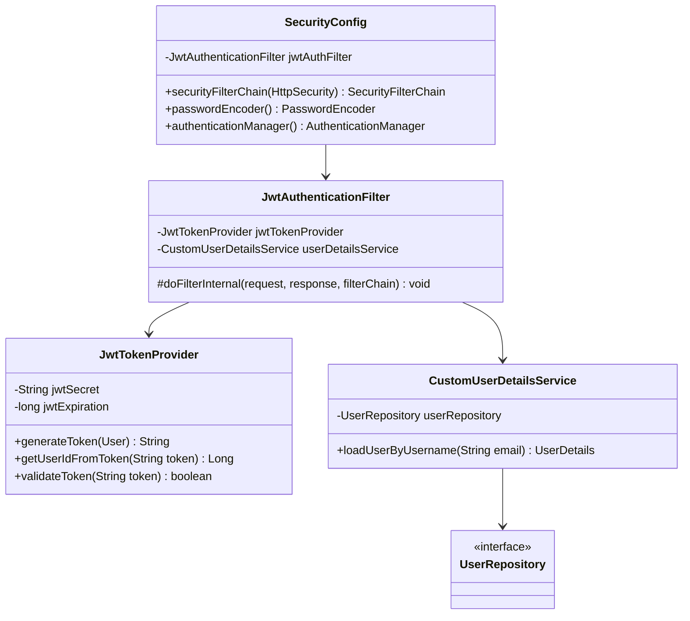

## 2.7 Exception Classes

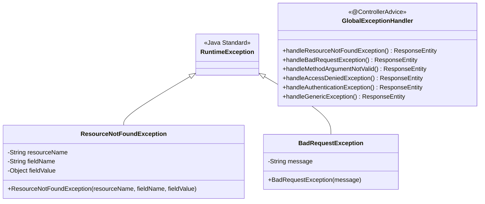

## 2.8 Validation Annotations (per Request DTO)

| DTO | Field | Annotation | Pesan |
|-----|-------|------------|-------|
| `RegisterRequest` | `name` | `@NotBlank` | Nama tidak boleh kosong |
| | `email` | `@NotBlank`, `@Email` | Email harus valid |
| | `password` | `@NotBlank`, `@Size(min=8)` | Password minimal 8 karakter |
| `LoginRequest` | `email` | `@NotBlank`, `@Email` | Email harus valid |
| | `password` | `@NotBlank` | Password tidak boleh kosong |
| `ProductRequest` | `name` | `@NotBlank` | Nama produk tidak boleh kosong |
| | `price` | `@NotNull`, `@DecimalMin("0")` | Harga tidak boleh negatif |
| | `stock` | `@NotNull`, `@Min(0)` | Stok tidak boleh negatif |
| | `categoryId` | `@NotNull` | Kategori wajib diisi |
| `CategoryRequest` | `name` | `@NotBlank` | Nama kategori tidak boleh kosong |
| `CartItemRequest` | `productId` | `@NotNull` | Product ID wajib |
| | `quantity` | `@NotNull`, `@Min(1)` | Quantity minimal 1 |
| `ChangePasswordRequest` | `currentPassword` | `@NotBlank` | Password lama wajib diisi |
| | `newPassword` | `@NotBlank`, `@Size(min=8)` | Password baru minimal 8 karakter |

---
---

# 🏛️ Part 3: Architecture Design

## 3.1 Layered Architecture

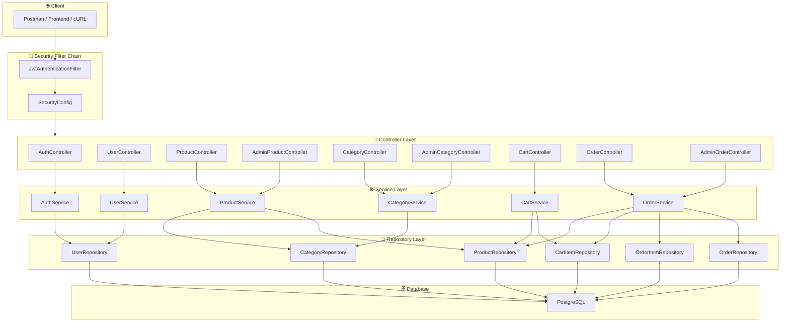

### Tanggung Jawab Tiap Layer

| Layer | Tanggung Jawab | Anotasi Spring |
|-------|---------------|----------------|
| **Controller** | Menerima HTTP request, validasi input, mapping DTO, return response | `@RestController`, `@RequestMapping` |
| **Service** | Business logic, validasi bisnis, koordinasi repository | `@Service`, `@Transactional` |
| **Repository** | Akses database via JPA/Hibernate | `@Repository`, extends `JpaRepository` |
| **Security** | Autentikasi JWT, otorisasi role-based | `@Configuration`, `OncePerRequestFilter` |
| **Exception** | Menangkap exception dan map ke HTTP response | `@ControllerAdvice`, `@ExceptionHandler` |

## 3.2 Request Lifecycle

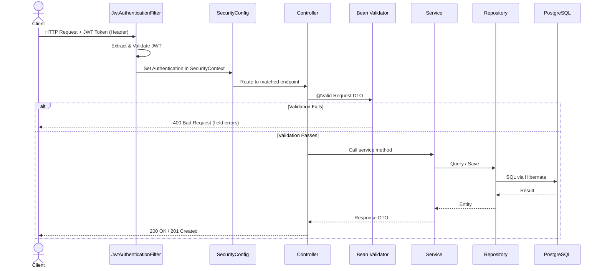

## 3.3 Security Architecture

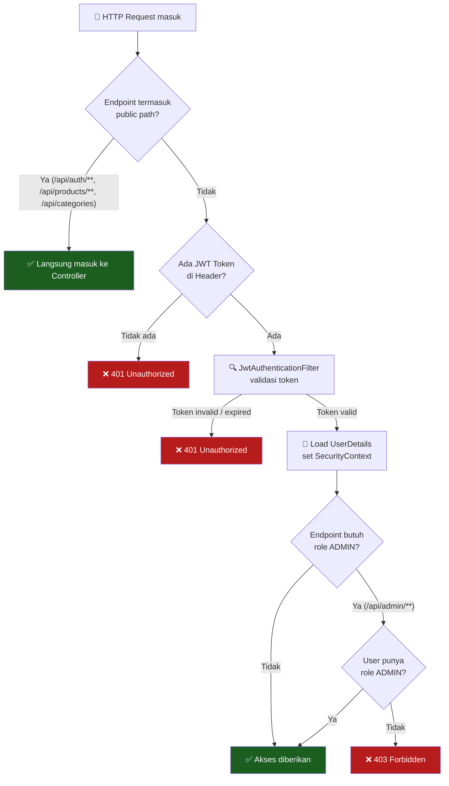

### Konfigurasi Endpoint Access

```
Public (tanpa login):
├── POST   /api/auth/register
├── POST   /api/auth/login
├── GET    /api/products/**
└── GET    /api/categories

Authenticated (perlu login):
├── GET    /api/users/me
├── PUT    /api/users/me
├── PUT    /api/users/me/password
├── GET    /api/cart
├── POST   /api/cart/items
├── PUT    /api/cart/items/{id}
├── DELETE /api/cart/items/{id}
├── POST   /api/orders/checkout
├── GET    /api/orders
└── GET    /api/orders/{id}

Admin Only (perlu role ADMIN):
├── POST   /api/admin/products
├── PUT    /api/admin/products/{id}
├── DELETE /api/admin/products/{id}
├── POST   /api/admin/categories
├── PUT    /api/admin/categories/{id}
├── DELETE /api/admin/categories/{id}
├── GET    /api/admin/orders
└── PUT    /api/admin/orders/{id}/status
```

## 3.4 Sequence Diagram — Fitur Utama

### 3.4.1 Register → Login

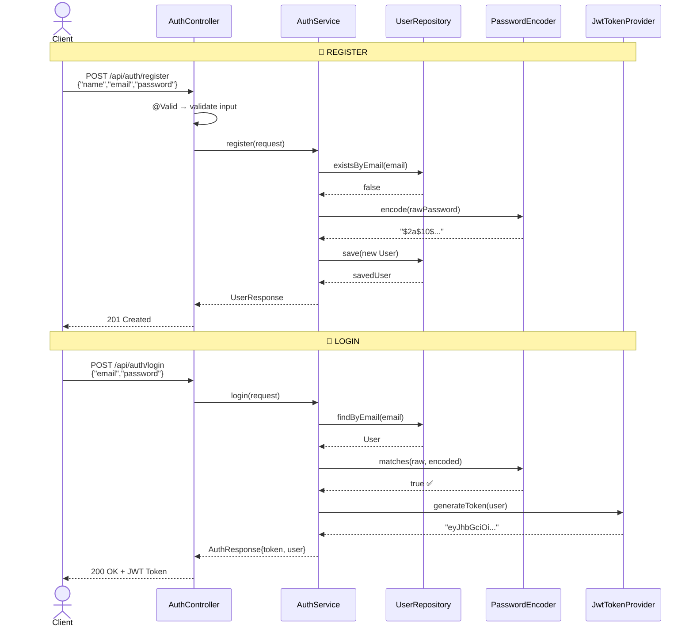

### 3.4.2 Checkout Flow

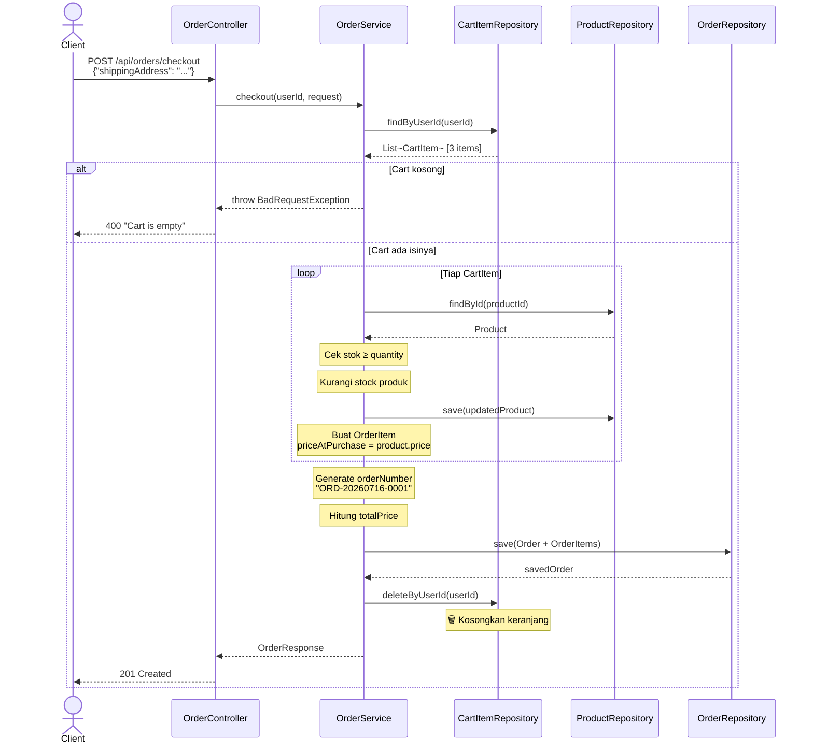

### 3.4.3 Product Catalog — Search, Filter, Pagination

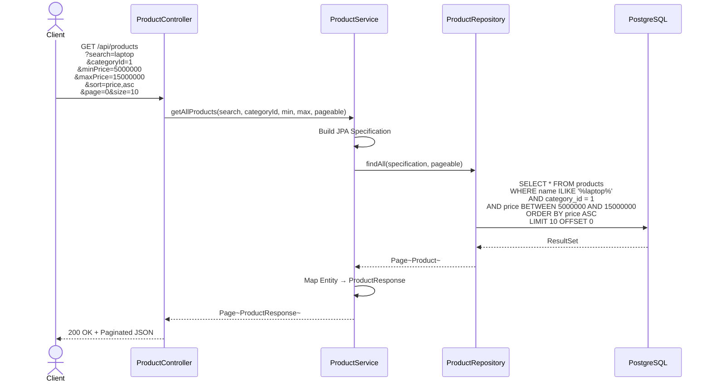

## 3.5 Error Handling Architecture

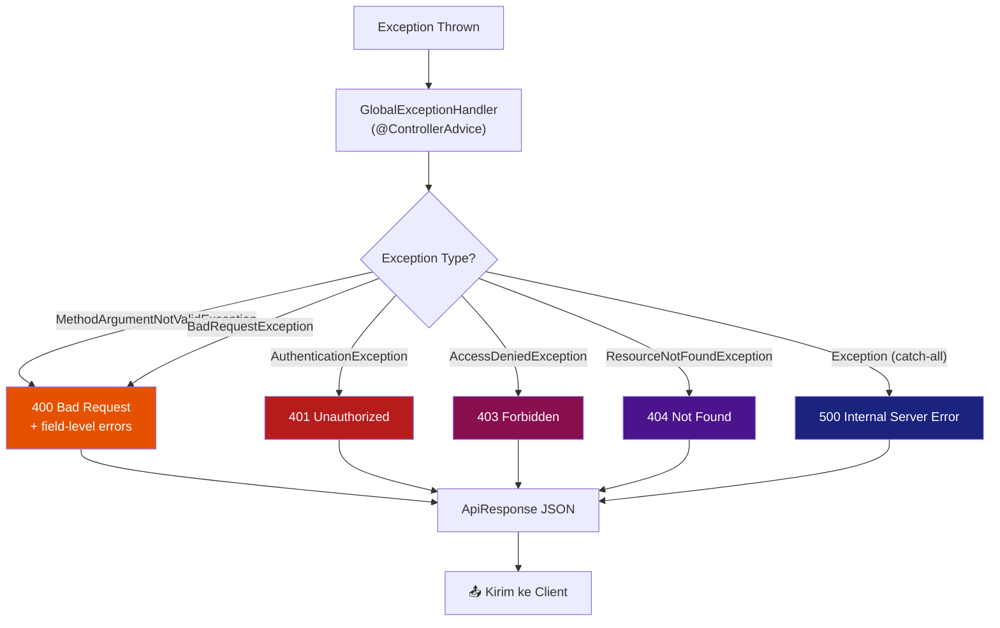

### Contoh Error Response

````carousel
```json
// 400 Bad Request — Validation Error
{
    "success": false,
    "message": "Validation failed",
    "data": {
        "email": "Email harus valid",
        "password": "Password minimal 8 karakter"
    },
    "timestamp": "2026-07-16T19:20:00"
}
```
<!-- slide -->
```json
// 401 Unauthorized
{
    "success": false,
    "message": "Invalid email or password",
    "data": null,
    "timestamp": "2026-07-16T19:20:00"
}
```
<!-- slide -->
```json
// 404 Not Found
{
    "success": false,
    "message": "Product not found with id: 99",
    "data": null,
    "timestamp": "2026-07-16T19:20:00"
}
```
````

## 3.6 Package Structure

```
com.alfarizy.ecommerce/
│
├── EcommerceApplication.java              ← Main class
│
├── config/                                ← Konfigurasi Spring
│   ├── SecurityConfig.java                  ← Security filter chain, CORS
│   └── AppConfig.java                       ← Bean definitions
│
├── security/                              ← Komponen keamanan
│   ├── JwtTokenProvider.java                ← Generate & validate JWT
│   ├── JwtAuthenticationFilter.java         ← Filter intercept tiap request
│   └── CustomUserDetailsService.java        ← Load user dari DB
│
├── entity/                                ← JPA Entity (mapping ke tabel DB)
│   ├── User.java
│   ├── Product.java
│   ├── Category.java
│   ├── CartItem.java
│   ├── Order.java
│   ├── OrderItem.java
│   ├── Role.java                            ← Enum
│   └── OrderStatus.java                     ← Enum
│
├── dto/                                   ← Data Transfer Objects
│   ├── request/
│   │   ├── RegisterRequest.java
│   │   ├── LoginRequest.java
│   │   ├── UpdateProfileRequest.java
│   │   ├── ChangePasswordRequest.java
│   │   ├── ProductRequest.java
│   │   ├── CategoryRequest.java
│   │   ├── CartItemRequest.java
│   │   ├── UpdateCartItemRequest.java
│   │   ├── UpdateOrderStatusRequest.java
│   │   └── CheckoutRequest.java
│   └── response/
│       ├── ApiResponse.java
│       ├── AuthResponse.java
│       ├── UserResponse.java
│       ├── ProductResponse.java
│       ├── CategoryResponse.java
│       ├── CartItemResponse.java
│       ├── CartResponse.java
│       ├── OrderResponse.java
│       └── OrderItemResponse.java
│
├── repository/                            ← Data Access Layer
│   ├── UserRepository.java
│   ├── ProductRepository.java
│   ├── CategoryRepository.java
│   ├── CartItemRepository.java
│   ├── OrderRepository.java
│   └── OrderItemRepository.java
│
├── service/                               ← Business Logic Layer
│   ├── AuthService.java
│   ├── UserService.java
│   ├── ProductService.java
│   ├── CategoryService.java
│   ├── CartService.java
│   └── OrderService.java
│
├── controller/                            ← REST API Layer
│   ├── AuthController.java
│   ├── UserController.java
│   ├── ProductController.java
│   ├── AdminProductController.java
│   ├── CategoryController.java
│   ├── AdminCategoryController.java
│   ├── CartController.java
│   ├── OrderController.java
│   └── AdminOrderController.java
│
└── exception/                             ← Error Handling
    ├── GlobalExceptionHandler.java
    ├── ResourceNotFoundException.java
    └── BadRequestException.java
```

---
---

## 📊 Design Summary

| Aspek | Jumlah | Detail |
|-------|--------|--------|
| **Tabel Database** | 6 | users, categories, products, cart_items, orders, order_items |
| **Enum** | 2 | Role, OrderStatus |
| **Entity Classes** | 8 | 6 entity + 2 enum |
| **Request DTOs** | 10 | Register, Login, Profile, Password, Product, Category, Cart, UpdateCart, Checkout, UpdateOrderStatus |
| **Response DTOs** | 9 | Api, Auth, User, Product, Category, CartItem, Cart, Order, OrderItem |
| **Controllers** | 9 | Termasuk pemisahan admin controller |
| **Services** | 6 | Auth, User, Product, Category, Cart, Order |
| **Repositories** | 6 | Semua extends JpaRepository |
| **API Endpoints** | ~21 | Public (5), Authenticated (10), Admin (8) |

> [!TIP]
> Dokumen ini bisa dijadikan referensi utama saat implementasi. Setiap diagram bisa langsung di-mapping ke kode Java yang akan dibuat.
